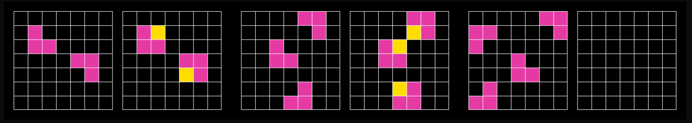

In early 2025, reasonable people looked at recent AI progress and concluded it would slow down. Reinforcement learning with verifiable rewards (RLVR) was (a) too brittle for long tasks and (b) inefficient. How would we get the compute? Would models really learn what to do after coding for tens of hours and figure out that commit `346ca09` was the one that caused an annoying button to flicker?

After a year, it looks like *RLVR just works* – for the shape of the current AI market. AI progress has done the opposite of reasonable and accelerated since 2024 because of it. The early concerns about RL compute scaling and reward signal collapse pointed at an unease with how LLMs improve at tasks, and that’s because *RLVR just works* ... *for verifiable domains*. Specifically.

The labs have relied on the multiplication of narrow targets. Benchmarks not only measure but drive progress, and the ecosystem has evolved around verifiability. The state-of-the-art has advanced by swallowing the bitter pills of RL scaling, while relying on progressively-more-expensive human knowledge. There was a lot of room for verifiability in 2025. There may not be in 2027.

## Horizon lengths have a ladder

The horizon-length argument assumed an RL substrate that does not exist. It imagined RL-on-LLMs as RL-on-Atari with longer episodes: you only get sparse terminal rewards like a passing unit test, and naive credit assignment over multi-day rollouts. Imagine if you were only ever told you were going in the right direction at work during your quarterly evaluation.

But we can convert long-horizon problems into dense-reward problems via reasoning traces. Every token in the chain of thought is a credit-assignment opportunity, and this works exceptionally well for repeatable tasks like coding. Even if you’re not done building a whole app, a passing test for a function is signal.

And so consider the difference between writing a complicated new app and a new mathematical proof. The elements of a new app were in previous software examples; writing correct code for small tasks got rewarded to oblivion. It is straightforward for Claude to compose the rewarded reasoning traces into something that works. If the previous iteration of a model already got rewarded for completing 8-hour tasks, that ability is leveraged into the next iteration for longer tasks that use similar reasoning.

The proof would be different. A useful mathematical object that doesn’t result in a happy QED isn’t rewarded. There is composability in the use of mathematical concepts for known problems using known concepts, even at Frontier Math levels. But new objects, even if they could be grasped, would have no generation signal. Approaches so orthogonal to standard practice that they’re not in the training set won’t appear in a long chain of thought, even if the model in theory knows all the relevant concepts.

Quoting [Epoch](https://epoch.ai/gradient-updates/how-persistent-is-the-inference-cost-burden): RL “unlocks ... new tasks in large part by allowing the model to productively use longer outputs (chain of thought, tool calls, or writing) when completing them.” METR’s [decomposition of where the gains come from](https://arxiv.org/html/2503.14499v1) is the same observation, empirically: improved logical reasoning, better tool use, greater reliability and self-awareness in task execution are downstream from longer reasoning traces.

The dense reward channel only works where you can verify, even partially, what the chain of thought is doing. It’s easier to score whether a test passed than whether a turn of phrase improved an essay.

## How much more OOMf?

The second worry looks premature, but is more accurate. RL reasoning compute was a small fraction of total training compute by early 2025; on the high end Epoch [estimates DeepSeek-R1’s RL stage at ~6e23 FLOP, roughly 20% of the pre-training cost](https://epoch.ai/gradient-updates/how-far-can-reasoning-models-scale) of its base model. Llama-Nemotron Ultra’s RL stage was under 1%. Phi-4-reasoning’s was under 0.01%. You can grow a 1% allocation by 100x and still “merely” double your compute needs.

But there is a real bear case. Toby Ord [estimated](https://forum.effectivealtruism.org/posts/TysuCdgwDnQjH3LyY/how-well-does-rl-scale) that matching a GPT-generation jump via RL scaling alone would require something like a million-fold compute scale-up, because “RL training… receives less than a ten-thousandth as much information to learn from per FLOP.” That constrains the reach of RLVR. It is a much weaker constraint on the immediate trajectory, which is where the prediction went wrong. We weren’t near the ceiling, but we are climbing the ladder.

## Natural selection on targets

The climbing is pretty predictable. The METR doubling is on software and research tasks with clean algorithmic scoring. As METR [published](https://metr.org/time-horizons/): “AI agent performance drops substantially when scoring AI performance holistically rather than algorithmically. \[…\] Our tasks are much ‘cleaner’ than real economically valuable labor.” The headline metrics for fast progress measure slices of reality where verifiability is unusually total. The next benchmarks to come online won’t be different: Epoch’s new [MirrorCode benchmark](https://epoch.ai/blog/mirrorcode-preliminary-results) measures software capabilities by providing tight specs and behavior to be replicated. You could say much software development is in fact like this. Most of it isn’t.

Alas, verifiability drives every impressive curve since November 2024. In late 2025, [a paper](https://arxiv.org/pdf/2509.20357) proposed learned reward models to work around the fact that “RLVR leads to limited generalization for open-ended tasks—such as writing outline essays or making meal plans—where humans reason routinely.” The dense-reward substrate that made fast progress possible does not extend smoothly to tasks without verifiers. It is being painstakingly extended via reward modeling, which if I understand correctly encourages more reward hacking.

*Within* verifiable domains, the gains are narrower than they look. [Recent work on combinatorial reasoning](https://arxiv.org/pdf/2510.27044) finds that RLVR “improves evaluation metrics but often by reinforcing superficial heuristics rather than acquiring new reasoning strategies.” It’s not cope to flag that the headline doubling-time acceleration [depends partly on scaffold-tuning specific to the RE-Bench tasks](https://medium.com/@AIchats/are-ai-time-horizons-still-doubling-every-7-months-6262ed2bcc6a) that anchor the upper end of the curve. And that upper end is now [saturated](https://metr.org/time-horizons/) by Mythos.

The strongest apparent counterexample is ARC-AGI-2, which Anthropic’s [Opus 4.6 system card](https://www-cdn.anthropic.com/14e4fb01875d2a69f646fa5e574dea2b1c0ff7b5.pdf) reports the model solving at 69.17% without any benchmark-specific training. But ARC is a verifiable benchmark, programmatic scoring on input-output grids. And Opus 4.6 *was* trained on ARC-AGI-1, which rhymes with its sequel in how it evaluates spatial reasoning.

*Clearly completely orthogonal skills. Top: ARC-AGI-1 sample task, bottom: ARC-AGI-2 sample task. Sources: [ARC-AGI-1](https://arcprize.org/arc-agi/1), [ARC-AGI-2](https://arcprize.org/arc-agi/2).*

It is impressive generalization *within* the verifiability boundary. It is not evidence that the boundary is moving.

The fast-progress story and the narrowing-target story are not contradictory. Instead of watching a general-purpose discovery process improve, we are witnessing a particular technique compound where it works, while the field gets better at expanding that slice through clever environment construction.

Claude models might currently be the most economically valuable, commercially available LLMs. Yet Opus 4.7 achieves 61.7% on [SimpleBench](https://simple-bench.com/), which tests intuitive reasoning, and is 18 pp behind Gemini 3.1 Pro, the top model. Sonnet 3.7, from more than a year earlier, achieved 46.4%. Multiple niche benchmarks, like [chess puzzles](https://epoch.ai/benchmarks/chess-puzzles?view=graph&tab=release-date), have routine reversals because they’re not important enough to dedicate much of an RL budget to.

When you don’t have a continual learner and hope that in-context learning will solve everything, you’re limited by your training context.

## Just one more eval

Neither the bearish nor the optimistic prediction held. The bitter lesson predicted meta-methods would beat baked-in human knowledge, but RLVR is a meta-method structurally dependent on human knowledge: specifically on humans knowing how to write a grader. Can the verifiability boundary move? If METR’s time horizon on HCAST/RE-Bench/SWAA continues doubling through 2027, but [the gap between algorithmic and holistic scoring](https://metr.org/blog/2025-08-12-research-update-towards-reconciling-slowdown-with-time-horizons/) widens rather than narrows, the skeptics might have a case despite the zero-days and multi-month SaaS products. There will be a lot more code. Every economically important *score* will keep going up, even if not every economically valuable job will get meaningfully closer to full automation. But like all progress, it’s earned and not given. Complexity will remain a requirement for LLMs to do complex work.
